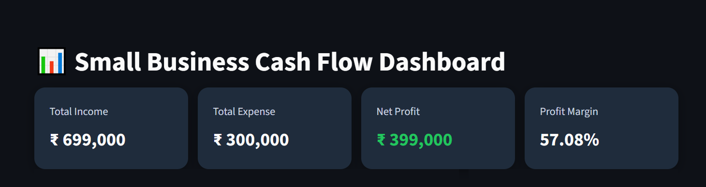
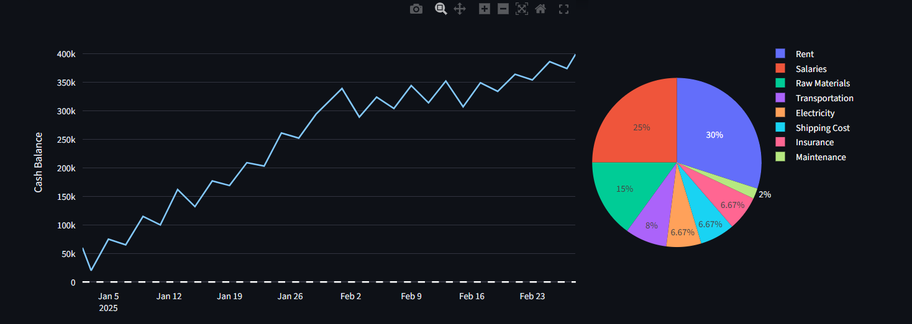
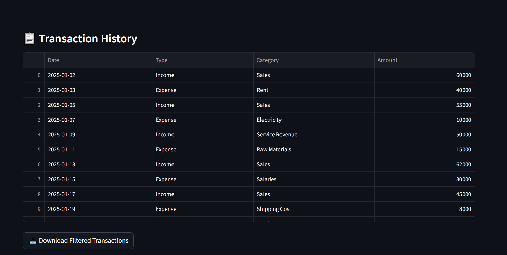
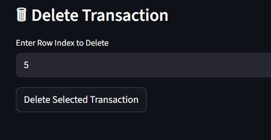
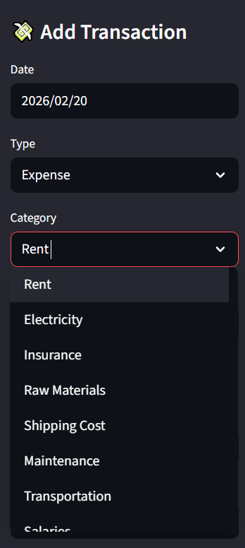
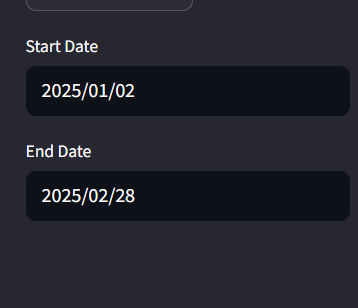

# 1) Why I Built This

Small businesses often struggle to track their financial health because:

- Income and expenses are not organized properly
- There is no real-time visibility of profit/loss
- Business owners rely on manual calculations
- Financial insights are not easily accessible

So, I built a simple dashboard that helps **track, visualize, and analyze cash flow in real-time**.

---

# 2) Problem Statement

Currently:

- Financial data is scattered (Excel, notes, memory)
- No centralized system to track transactions
- Hard to calculate profit and cash balance quickly
- No visual insights into spending patterns

This leads to:

- Poor financial decisions
- Lack of clarity on business performance
- Time-consuming manual tracking

---

# 3) My Goal With This Project

To build a **cash flow analytics dashboard** that:

- Tracks income and expenses dynamically
- Calculates key financial metrics automatically
- Visualizes business performance clearly
- Helps users understand their financial position

This is a **data-driven MVP dashboard for financial tracking**.

---

# 4) Who Would Use This

- Small business owners
- Freelancers
- Finance teams (basic use)
- Product managers (financial analytics use-case)

---

# 5) Features I Built

- Add transactions (Income / Expense)
- Delete transactions
- Date range filtering
- KPI metrics:
    - Total Income
    - Total Expense
    - Net Profit
    - Profit Margin
- Cumulative cash flow graph (stock-style)
- Category-wise expense breakdown (pie chart)
- Download filtered data as CSV

---

## 📊 Dashboard Overview

---

## 📈 Cash Flow & Expense Insights

---

## 📋 Transaction History

---

## 🗑 Delete Transaction Feature

---

## ➕ Add Transaction Panel

---

## 📅 Date Filter

---

# 6) Financial Logic Used

### Net Profit = Total Income - Total Expense

---

### Profit Margin = (Net Profit / Total Income) × 100

---

### Cash Flow Tracking

- Income → Positive value
- Expense → Negative value
- Cumulative sum → Running cash balance

This helps simulate **real-time business cash position**

---

# 7) KPIs I Defined

## Primary KPIs

### Total Income

Total earnings over selected time period

### Total Expense

Total spending over selected time period

### Net Profit

Indicates whether business is in profit or loss

### Profit Margin

Shows efficiency of business operations

## Secondary KPIs

### Cumulative Cash Flow

Tracks how cash balance changes over time

### Expense Distribution

Identifies where money is being spent

# 8) What Success Looks Like

This product is successful if:

- Users can track finances easily
- Profitability becomes clearly visible
- Spending patterns are understood
- Decision-making becomes faster

---

# 9) Limitations

- Uses session-based data (no permanent storage)
- No authentication or multi-user support
- No predictive analytics or forecasting
- No integration with real financial systems

---

# 10) Tech Stack

- Python
- Streamlit
- Pandas
- Plotly

---

# 11) What I Learned From This Project

- How to design KPI-driven dashboards
- How to convert raw data into insights
- How to think from a product + business perspective
- How to build interactive data applications
